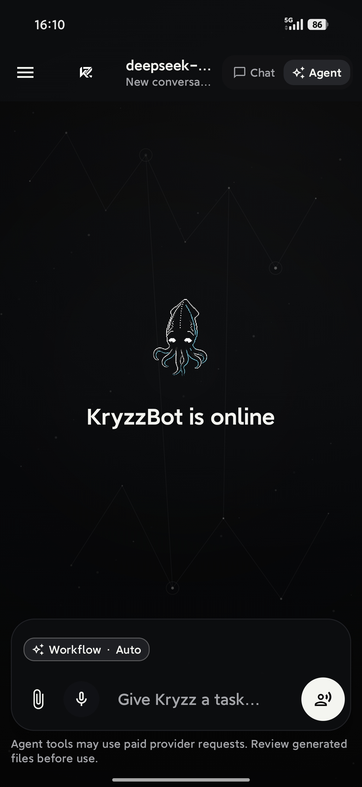
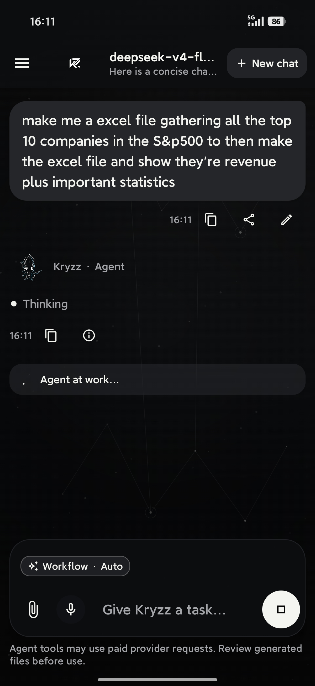
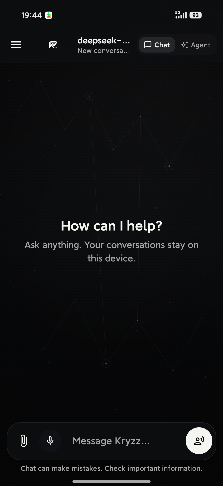
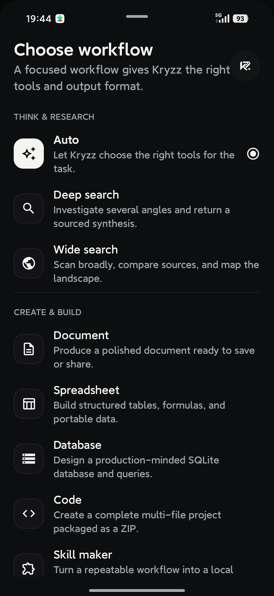
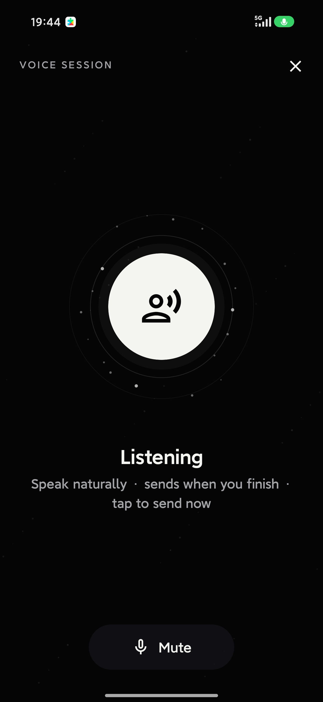
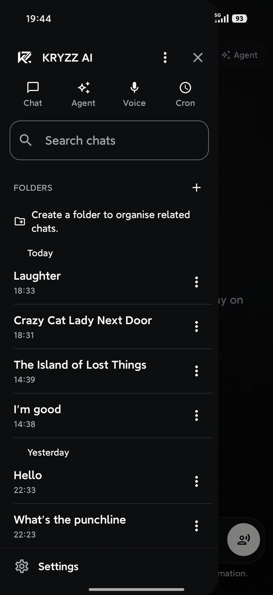
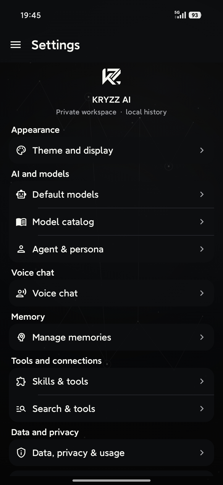
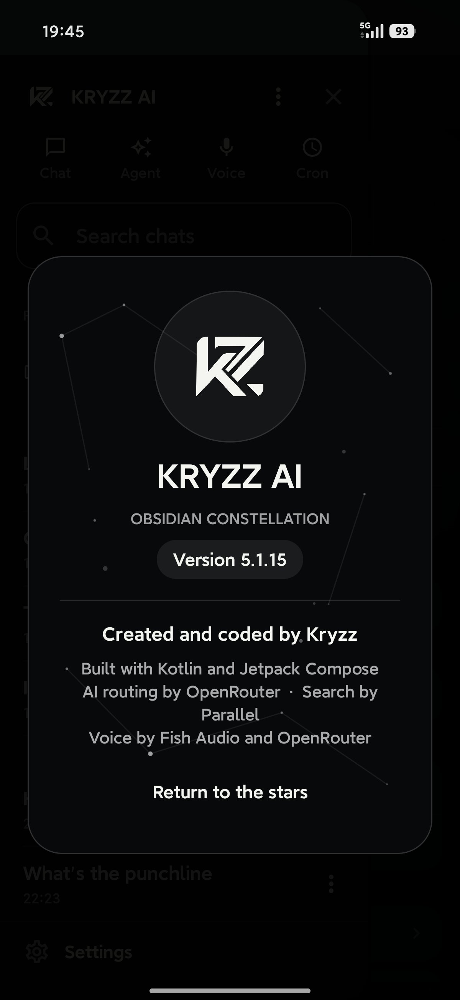

# Kryzz AI

> Public **v1.1.2**. The source in this repository is internal build **v5.11.0** (versionCode 84). Public **v1.1** was internal **v5.7.2**. Public **v1.0** was internal **v5.1.15**. Builds 1.x through 5.1.14 were never published. There is no public v1.1.1.

A private, local-first Android AI workspace for chat, voice, and tool-driven workflows.

Kryzz AI runs on your device and talks directly to the AI providers you choose — OpenRouter, optional MiniMax, optional Fish Audio for voice synthesis, and optional Parallel for web research. Nothing leaves your phone that you didn't put there yourself: no bundled API keys, no analytics, no telemetry, no HTTP logging.

Build it yourself, read the code, fork it.

---

## What's new in v1.1.2

Since public v1.1 (internal 5.7.2). This drop is internal **5.11.0**.

- **Live plan card.** Agent Auto keeps a checklist through the turn. Planning steps do not eat the work budget.
- **Safer page reads.** `fetch_url` only opens a link you shared, a search result from this chat, or a site you named.
- **Review before send.** Substantial answers get one check against the tool results. Short questions skip it.
- **Cost cap.** Default $0.25 per turn, adjustable up to $2. Hitting the cap still finishes the answer.
- **Fast / Balanced / Max.** A chip on the Agent composer. Max uses the strongest model, a 24-step budget, and the review pass.
- **Finished files.** DOCX, XLSX, and PDF share one Markdown model: real headings, lists, tables, typed spreadsheet cells, multi-sheet workbooks, and Unicode PDFs.
- **Work log.** Each agent answer can show what it did ("3 searches · read 4 pages · 1 file") and expand into the steps. Activity chips name the query, page, or place.

See [`CHANGELOG.md`](./CHANGELOG.md). This drop's notes: [`RELEASE_NOTES_5.11.0.md`](./RELEASE_NOTES_5.11.0.md). Older public notes: [`RELEASE_NOTES_5.7.2.md`](./RELEASE_NOTES_5.7.2.md) (v1.1) and [`RELEASE_NOTES_5.1.15.md`](./RELEASE_NOTES_5.1.15.md) (v1.0).

---

## Screenshots

| KryzzBot online | Agent at work |
| :-------------: | :-----------: |
|  |  |

| New chat | Agent workflows |
| :------: | :-------------: |
|  |  |

| Voice session | Side drawer |
| :------------: | :---------: |
|  |  |

| Settings | About |
| :------: | :---: |
|  |  |

---

## What you can do

- **Chat.** Streamed conversations with a model you pick, attachments, reasoning controls, editing, regeneration, cancellation, citations, token usage, and cost details. The model can also ask you a question with tappable options instead of guessing.
- **Agent.** Bounded tool workflows, deep research, wide web search, content creation, reusable local skills, and generated files. Auto can search, fetch an allowed page, do arithmetic, check the weather, remember facts, schedule a reminder, keep a live plan, and produce documents, spreadsheets, PDFs, or code zips. Fast / Balanced / Max sits on the composer.
- **Voice.** Microphone transcription, spoken replies, automatic turn-taking, and barge-in to interrupt Kryzz mid-sentence.
- **Memory.** Local, searchable, categorized, per-entry enable/disable, with optional cross-chat recall during conversation.
- **Library.** Pin, folder, search, rename, delete, and JSON-import/export your conversations and skills.
- **Generated outputs.** DOCX, XLSX, PDF, SQLite, code ZIPs, images, video, and music, kept in private app storage until you share them. Documents, spreadsheets, and PDFs share one Markdown model, including typed cells and multi-sheet workbooks.

Multimodal attachments and generated media require a model that supports them. Search and voice features need the relevant provider configured.

---

## Download (debug APK)

A pre-built debug APK for the source in this repository is published as a **GitHub Release**:

👉 **[`v1.1.2` release page →](https://github.com/kriddss3/kryzz-ai/releases/tag/v1.1.2)** — download `kryzz-ai-5.11.0-debug.apk` (debug-signed).

A copy of the same APK is also committed in this repo at:

```
work-assets/releases/kryzz-ai-5.11.0-debug.apk
```

Debug-signed with the Android Studio default key, package `ai.daylight.assistant.debug`.

Previous public builds stay up: [`v1.1`](https://github.com/kriddss3/kryzz-ai/releases/tag/v1.1) (`kryzz-ai-5.7.2-debug.apk`) and [`kryzz-AI-v1-(debug)`](https://github.com/kriddss3/kryzz-ai/releases/tag/kryzz-AI-v1-(debug)) (`kryzz-ai-5.1.15-debug.apk`).

**To install on Android 9+:**

1. Download the APK (release page, or grab from the repo path above).
2. Transfer to the device (USB, cloud, AirDrop-via-web, whatever).
3. On the device: **Settings → Apps → Special access → Install unknown apps** → allow your file manager.
4. Tap the APK and confirm.
5. Launch Kryzz AI from the launcher.

> This is a debug build meant for evaluation and sideloading. For long-term installs on a daily-driver device, build your own signed release APK from this source.
>
> The debug package id is `ai.daylight.assistant.debug`. versionCode 84 upgrades in place over the v1.1 and v1.0 debug APKs. It will **not** replace a separately signed `ai.daylight.assistant` release install.

---

## Privacy, in one breath

- Everything you write or save is stored locally on the device (Room + DataStore).
- Credentials are encrypted with **AES-GCM** under a non-exportable **Android Keystore** key. They are never sent anywhere.
- Conversation **backups** never include credentials.
- Android backup, device-to-device transfer, cleartext traffic, and HTTP logging are all **disabled**.
- The microphone is only active during a voice session; recorded audio is cached for transcription only and deleted afterward.
- Optional **coarse location** is used only when you enable Location in Settings, and only as text in requests you already send (weather / “nearby”).

One small thing: for a fresh conversation's auto-title, Kryzz may send at most the first 1,500 characters of your first message through OpenRouter to a small model (Gemini 2.5 Flash Lite) for naming. This runs in parallel with your first answer, never blocks it, and falls back to a local title if it can't complete.

---

## Providers you'll need

- **OpenRouter** — required for voice transcription and for OpenRouter chat/media. Also used for OpenRouter TTS.
- **MiniMax** *(optional)* — alternative chat, agent, and media provider (Token Plan Global). Switching providers resets model defaults to that catalog.
- **Parallel** *(optional)* — used only for explicit web search and research workflows.
- **Fish Audio** *(optional)* — for Fish-hosted voice synthesis; OpenRouter TTS also works.

Voice transcription stays on OpenRouter even when MiniMax is the chat provider.

You enter keys only inside the installed app. They are not part of this repository and not needed to build it.

---

## Requirements

- **JDK 17**
- **Android SDK platform 35**
- **Android Build Tools 35.0.0**
- Network access for the first Gradle dependency resolution

Minimum runtime: **Android 9 / API 28**.
Included wrapper: **Gradle 8.9**.

---

## Build

```powershell
.\gradlew.bat assembleDebug
```

Unit tests:

```powershell
.\gradlew.bat testDebugUnitTest
```

Android instrumented tests (needs an emulator or device connected):

```powershell
.\gradlew.bat connectedDebugAndroidTest
```

The debug APK is written to:

```
app/build/outputs/apk/debug/app-debug.apk
```

Debug package: `ai.daylight.assistant.debug`.
Release package: `ai.daylight.assistant`.

---

## Release signing

Signing material is **never** committed. Production credentials are read only from environment variables:

```powershell
$env:KRYZZ_KEYSTORE='C:\secure\kryzz-release.jks'
$env:KRYZZ_STORE_PASSWORD='<store password>'
$env:KRYZZ_KEY_ALIAS='kryzz-release'
$env:KRYZZ_KEY_PASSWORD='<key password>'
.\gradlew.bat assembleRelease
```

Without those variables Gradle produces an unsigned release build. The signing certificate must match any version already installed on a user's device for in-place upgrades to work.

---

## First run

1. Install the APK and launch Kryzz AI.
2. Enter an OpenRouter key (needed for voice, and for OpenRouter chat).
3. Test the key in the onboarding screen.
4. *(Optional)* Switch the chat provider to MiniMax and enter a MiniMax key.
5. *(Optional)* Enter a Parallel key for web research.
6. *(Optional)* Pick a voice provider (Fish Audio or OpenRouter TTS).
7. *(Optional)* Toggle cross-chat memory.

---

## Architecture (one-screen tour)

| Layer         | Responsibility                                                                |
| ------------- | ----------------------------------------------------------------------------- |
| `data/local`  | Room entities, DAO, migrations, DB schema                                     |
| `data/prefs`  | DataStore-backed settings + legacy-value coercion                             |
| `data/remote` | Provider clients, request schemas, streaming, MiniMax media, error handling   |
| `security`    | Android-Keystore-backed credential encryption                                 |
| `domain`      | Agent loop, quality presets, plan, review, files, citations, question cards  |
| `voice`       | Recording, playback, adaptive turn detection, session state                   |
| `ui`          | Compose navigation, screens, drawer, design system, ViewModels, KryzzBot      |

**Stack:** Kotlin · Jetpack Compose (Material 3) · Coroutines / Flow · Room · DataStore · OkHttp · MVVM.

---

## Repository layout

```
app/                     ← Kotlin source, Android resources, tests, Room schemas
build.gradle.kts
settings.gradle.kts
gradle/  gradlew*        ← Gradle wrapper
CHANGELOG.md             ← public v1.0 → v1.1.2 summary
RELEASE_NOTES_5.11.0.md  ← v1.1.2 internal notes
RELEASE_NOTES_5.1.15.md  ← v1.0 internal notes
RELEASE_NOTES_5.7.2.md   ← v1.1 internal notes
work-assets/
  ├── screenshots/       ← screenshots embedded in this README
  ├── releases/          ← compiled APKs (debug-signed, eval-only)
  ├── kryzz-mark-chroma.png
  └── qa-4.0.1/          ← older QA assets (historical reference)
```

---

## License

MIT — see [`LICENSE`](./LICENSE).

Copyright (c) 2026 Kristofers Kemers.
